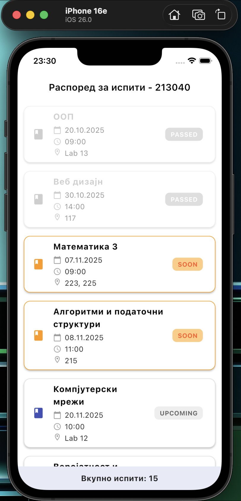
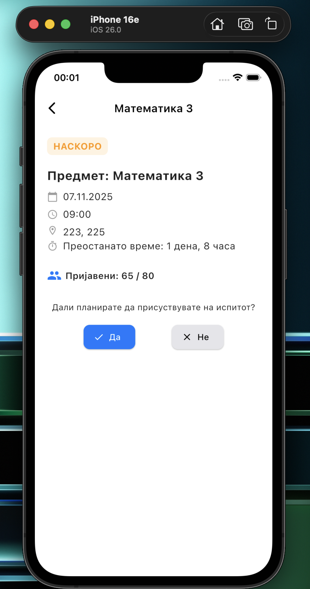

# Exam Schedule – Flutter Application

### 👨‍💻 Author
**Gjorgi Andonovski**  

---

## Application Description
This Flutter application displays an **exam schedule** for a student, showing each subject’s name, date, time, classroom, and exam status.  
It was developed as part of the *Mobile Information Systems* course to demonstrate the use of **Flutter widgets**, **model classes**, **state management**, and **UI design principles**.

---

##  Key Features
- **Home Screen (Exam List Screen)**  
  - Displays a list of more than 10 exams using Card widgets.  
  - Each exam shows its subject name, date, time, and classroom.  
  - Exams are automatically sorted chronologically by date.  

- **Color by Status:**  
  - *Passed exam* – gray color (unclickable)  
  - *Upcoming soon* – orange border and badge  
  - *Future exam* – default white card  

- **Exam Detail Screen**  
  - Displays all details for the selected exam: subject, date, time, classroom.  
  - Calculates and displays the **remaining time** until the exam in the format *“X days, Y hours.”*  
  - Includes **Yes / No** buttons allowing the user to mark if they plan to attend the exam.  
  - Buttons automatically become disabled (gray) after making a selection.  
  - Shows the number of registered students and total capacity for each classroom.  

---

## Project Structure

```text
lib/
├─ main.dart
├─ models/
│  └─ exam.dart
├─ screens/
│  ├─ exam_list_screen.dart
│  └─ exam_detail_screen.dart
└─ widgets/
   └─ exam_card.dart
   ```


The code is organized into three main layers:
- **models/** – data model classes  
- **screens/** – main app screens  
- **widgets/** – reusable UI components  

---

## How to Run and Use
1. Open the project in **Android Studio** or **VS Code**.  
2. Make sure **Flutter SDK** and an emulator or device are properly configured.  
3. In the terminal, execute:
   ```bash
   flutter pub get
   flutter run
The home screen will display the list of all exams.
Tap on any exam to open its detailed view.

Exams are visually categorized based on their status (Passed, Soon, Upcoming).

## Screeenshots

| Home Screen |  Exam Details |
|----------------|----------------|
|  |  |
